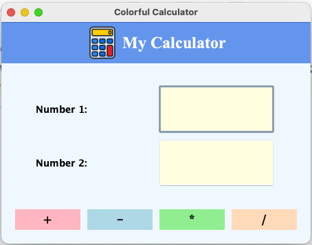
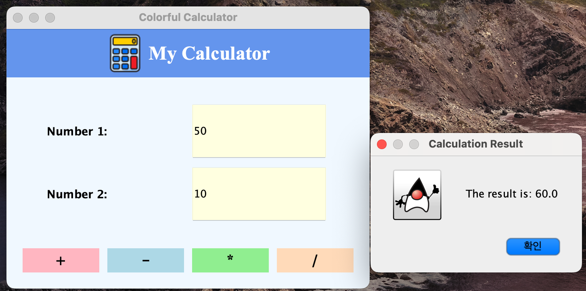
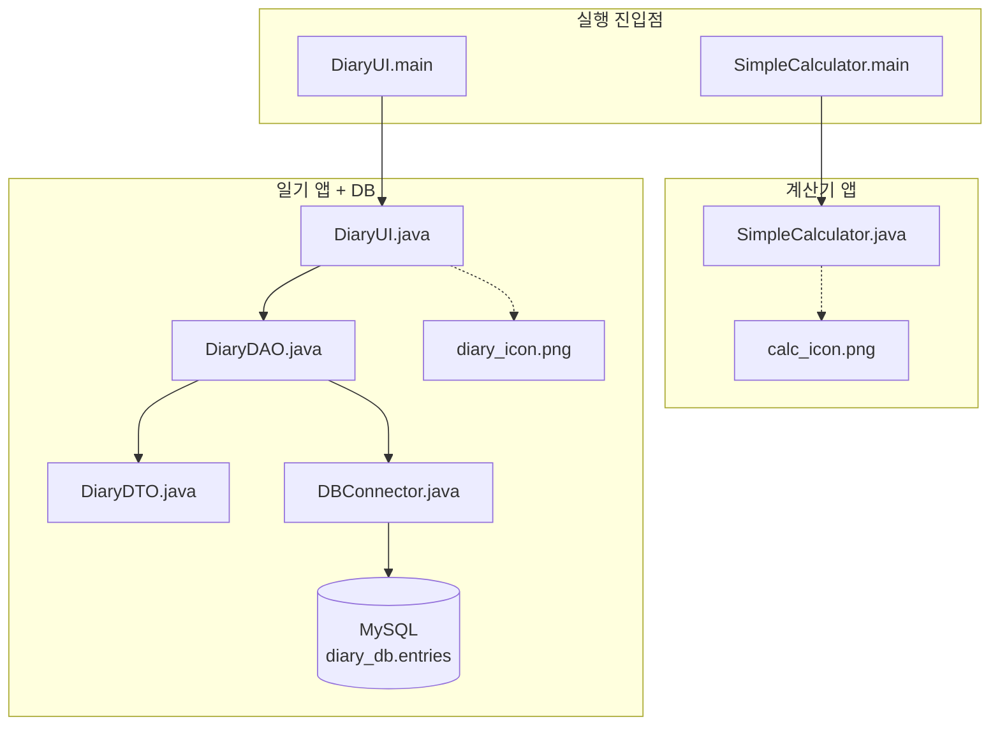
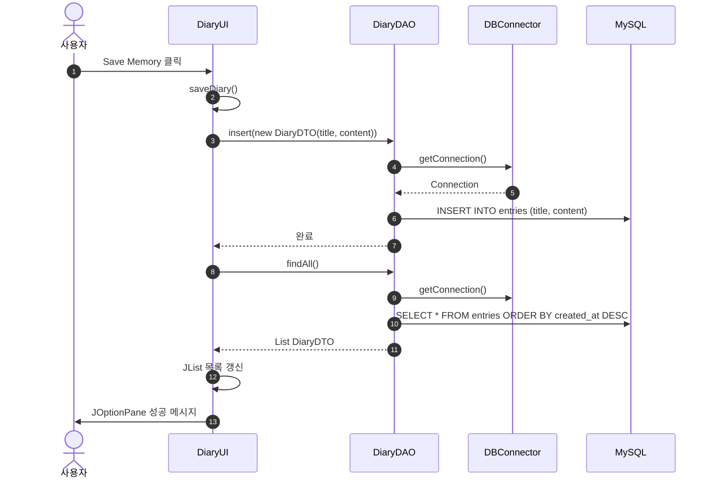
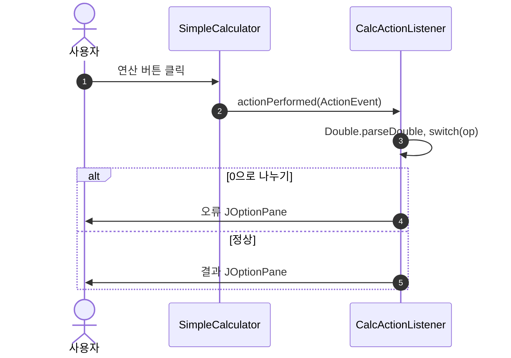
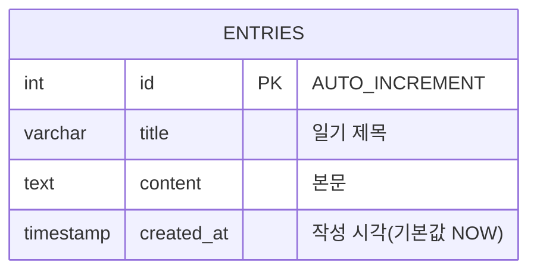

# 🎨 Colorful Simple Calculator (자바 Swing 계산기)

**Java Swing**을 활용한 **예쁜 GUI 계산기** 프로젝트입니다.  
간단한 사칙연산(+, -, *, /)을 지원하며, 색상 테마와 아이콘을 적용해 시각적으로 매력적으로 제작되었습니다.

# 메인화면



<br>

# 실행결과



## ✨ 주요 기능

- **사칙연산 지원**: 더하기(+), 빼기(-), 곱하기(*), 나누기(/)
- **예외 처리**: 
  - 0으로 나누기 방지
  - 숫자가 아닌 값 입력 시 경고
- **예쁜 UI 디자인**: 
  - pastel 색상 테마 (AliceBlue, CornflowerBlue 등)
  - 아이콘 적용 (calc_icon.png)
  - 반응형 버튼 색상
- **사용자 친화적**: 중앙 정렬, 직관적인 레이아웃

---

## 📁 프로젝트 구조

이 저장소는 **독립 실행되는 두 가지 Swing 예제**(계산기, 일기)와 **MySQL 일기 저장** 모듈로 구성됩니다.

```text
ai-java/
├── src/test/
│   ├── SimpleCalculator.java   # 사칙연산 GUI (main)
│   ├── DiaryUI.java            # 일기 GUI (main)
│   ├── DiaryDAO.java           # entries 테이블 삽입·조회
│   ├── DiaryDTO.java           # 일기 행(레코드) 모델
│   ├── DBConnector.java        # JDBC 연결 (diary_db)
│   ├── calc_icon.png           # (선택) 코드에서 참조
│   └── diary_icon.png          # (선택) 코드에서 참조
├── lib/
│   └── mysql-connector-j-9.1.0.jar   # MySQL JDBC 드라이버
├── out/ … (컴파일 산출물)
├── .gitignore
└── README.md
```

---

## 파일 간 관계 (Mermaid)

`SimpleCalculator`는 DB를 쓰지 않습니다. `DiaryUI`만 `DiaryDAO` → `DBConnector` → MySQL로 이어집니다.



---

## 클래스 다이어그램 (Mermaid)

```mermaid
classDiagram
    class JFrame
    class SimpleCalculator {
        -JTextField num1Field
        -JTextField num2Field
        +main(String[] args)$ void
    }
    class CalcActionListener {
        +actionPerformed(ActionEvent) void
    }
    class DiaryUI {
        -DiaryDAO dao
        +main(String[] args)$ void
    }
    class DiaryDAO {
        +insert(DiaryDTO dto) void
        +findAll() List~DiaryDTO~
    }
    class DiaryDTO {
        -int id
        -String title
        -String content
        -Timestamp createdAt
    }
    class DBConnector {
        +getConnection()$ Connection
    }

    JFrame <|-- SimpleCalculator
    JFrame <|-- DiaryUI
    SimpleCalculator +-- CalcActionListener : 내부 클래스
    DiaryUI o-- DiaryDAO : 사용
    DiaryDAO ..> DiaryDTO : 생성·매핑
    DiaryDAO ..> DBConnector : 연결 획득
```

---

## 시퀀스 다이어그램 (Mermaid)

### 일기 저장 후 목록 새로고침

사용자가 **Save Memory**를 누르면 `insert` 후 `findAll()`로 리스트를 다시 채웁니다.



### 계산기 연산



---

## 데이터베이스 (MySQL)

`DBConnector`는 JDBC URL `jdbc:mysql://localhost:3307/diary_db` 와 데이터베이스 `diary_db`를 사용합니다. 포트·계정은 환경에 맞게 `DBConnector.java`에서 조정하면 됩니다.

### ERD (논리 모델)

일기 한 건은 `entries` 테이블의 한 행입니다. `DiaryDAO`는 `id`, `title`, `content`, `created_at` 컬럼을 가정합니다.



### DDL 예시

아래는 코드와 맞춘 최소 스키마 예시입니다.

```sql
CREATE DATABASE IF NOT EXISTS diary_db
  CHARACTER SET utf8mb4
  COLLATE utf8mb4_unicode_ci;

USE diary_db;

CREATE TABLE IF NOT EXISTS entries (
    id          INT AUTO_INCREMENT PRIMARY KEY,
    title       VARCHAR(255) NOT NULL,
    content     TEXT         NOT NULL,
    created_at  TIMESTAMP    NOT NULL DEFAULT CURRENT_TIMESTAMP
) ENGINE=InnoDB;
```

### DML 예시

`DiaryDAO.insert`와 동일한 형태의 삽입, `findAll`과 유사한 조회입니다.

```sql
-- 새 일기 저장 (앱의 PreparedStatement와 동일 의미)
INSERT INTO entries (title, content)
VALUES ('오늘의 기록', '날씨가 좋았다.');

-- 목록 조회 (최신순, DAO의 SQL과 동일)
SELECT id, title, content, created_at
FROM entries
ORDER BY created_at DESC;

-- 조건부 검색 예시 (현재 DAO에는 없음, 확장 시 참고)
SELECT * FROM entries WHERE title LIKE '%일기%' ORDER BY created_at DESC;
```

---

## 🚀 실행 방법

### 1. IntelliJ IDEA (추천)
1. 프로젝트를 열기 (`ai-java` 폴더 열기)
2. `src/test/SimpleCalculator.java` 파일 열기
3. `main()` 메서드에서 **Run** 클릭

### 2. 명령줄(터미널)에서 실행
```bash
# 컴파일
javac -d out src/test/SimpleCalculator.java

# 실행
java -cp out test.SimpleCalculator
```

### 3. 일기 앱(DiaryUI) + MySQL

MySQL에 `diary_db`·`entries` 테이블을 만든 뒤, 드라이버를 classpath에 포함합니다.

```bash
javac -encoding UTF-8 -d out -cp "lib/mysql-connector-j-9.1.0.jar" \
  src/test/DBConnector.java src/test/DiaryDTO.java src/test/DiaryDAO.java src/test/DiaryUI.java

java -cp "out:lib/mysql-connector-j-9.1.0.jar" test.DiaryUI
```

Windows에서는 classpath 구분자를 `;`로 바꿉니다: `-cp "out;lib/mysql-connector-j-9.1.0.jar"`.

---

## 📄 전체 소스 코드

### `SimpleCalculator.java`

```java
package test;

import javax.swing.*;
import java.awt.*;
import java.awt.event.ActionEvent;
import java.awt.event.ActionListener;

public class SimpleCalculator extends JFrame {
    private JTextField num1Field;
    private JTextField num2Field;

    public SimpleCalculator() {
        setTitle("Colorful Calculator");
        setSize(450, 350);
        setDefaultCloseOperation(JFrame.EXIT_ON_CLOSE);
        getContentPane().setBackground(new Color(240, 248, 255)); // AliceBlue 배경
        setLayout(new BorderLayout(10, 10));

        // 상단: 이미지 및 타이틀
        JPanel topPanel = new JPanel();
        topPanel.setBackground(new Color(100, 149, 237)); // CornflowerBlue
        JLabel titleLabel = new JLabel("My Calculator", JLabel.CENTER);
        titleLabel.setForeground(Color.WHITE);
        titleLabel.setFont(new Font("Serif", Font.BOLD, 24));
        
        // 이미지 추가
        try {
            ImageIcon icon = new ImageIcon("src/test/calc_icon.png");
            Image scaledImage = icon.getImage().getScaledInstance(50, 50, Image.SCALE_SMOOTH);
            titleLabel.setIcon(new ImageIcon(scaledImage));
        } catch (Exception e) {
            System.out.println("Image not found, skipping icon.");
        }
        
        topPanel.add(titleLabel);
        add(topPanel, BorderLayout.NORTH);

        // 중앙: 입력 필드
        JPanel centerPanel = new JPanel(new GridLayout(2, 2, 5, 5));
        centerPanel.setBorder(BorderFactory.createEmptyBorder(20, 50, 20, 50));
        centerPanel.setBackground(new Color(240, 248, 255));

        JLabel lbl1 = new JLabel("Number 1:");
        lbl1.setFont(new Font("SansSerif", Font.BOLD, 14));
        num1Field = new JTextField();
        num1Field.setBackground(new Color(255, 255, 224)); // LightYellow

        JLabel lbl2 = new JLabel("Number 2:");
        lbl2.setFont(new Font("SansSerif", Font.BOLD, 14));
        num2Field = new JTextField();
        num2Field.setBackground(new Color(255, 255, 224));

        centerPanel.add(lbl1);
        centerPanel.add(num1Field);
        centerPanel.add(lbl2);
        centerPanel.add(num2Field);
        add(centerPanel, BorderLayout.CENTER);

        // 하단: 버튼들
        JPanel bottomPanel = new JPanel(new GridLayout(1, 4, 10, 10));
        bottomPanel.setBorder(BorderFactory.createEmptyBorder(0, 20, 20, 20));
        bottomPanel.setBackground(new Color(240, 248, 255));

        String[] ops = {"+", "-", "*", "/"};
        Color[] btnColors = {
            new Color(255, 182, 193),  // LightPink
            new Color(173, 216, 230),  // LightBlue
            new Color(144, 238, 144),  // LightGreen
            new Color(255, 218, 185)   // PeachPuff
        };

        for (int i = 0; i < ops.length; i++) {
            JButton btn = new JButton(ops[i]);
            btn.setBackground(btnColors[i]);
            btn.setOpaque(true);
            btn.setBorderPainted(false);
            btn.setFont(new Font("SansSerif", Font.BOLD, 18));
            btn.addActionListener(new CalcActionListener());
            bottomPanel.add(btn);
        }
        add(bottomPanel, BorderLayout.SOUTH);

        setLocationRelativeTo(null); // 화면 중앙 배치
        setVisible(true);
    }

    private class CalcActionListener implements ActionListener {
        @Override
        public void actionPerformed(ActionEvent e) {
            try {
                double n1 = Double.parseDouble(num1Field.getText());
                double n2 = Double.parseDouble(num2Field.getText());
                double result = 0;
                String op = e.getActionCommand();

                switch (op) {
                    case "+": result = n1 + n2; break;
                    case "-": result = n1 - n2; break;
                    case "*": result = n1 * n2; break;
                    case "/":
                        if (n2 == 0) {
                            showResult("Error: Cannot divide by zero!", "Math Error", JOptionPane.ERROR_MESSAGE);
                            return;
                        }
                        result = n1 / n2;
                        break;
                }
                showResult("The result is: " + result, "Calculation Result", JOptionPane.INFORMATION_MESSAGE);
            } catch (NumberFormatException ex) {
                showResult("Error: Please enter valid numbers!", "Input Error", JOptionPane.WARNING_MESSAGE);
            }
        }
    }

    private void showResult(String message, String title, int messageType) {
        JOptionPane.showMessageDialog(this, message, title, messageType);
    }

    public static void main(String[] args) {
        SwingUtilities.invokeLater(() -> new SimpleCalculator());
    }
}
```

---

## 🖼️ 실행 화면 예시

오류 처리 화면
- 숫자 미입력 / 문자 입력 → 경고창
- 0으로 나누기 → 오류 메시지

---

## 📚 개념 설명 (Java Swing 기초)

### 1. **JFrame**
- Swing 애플리케이션의 최상위 컨테이너 (창 자체)

### 2. **Layout Manager**
- `BorderLayout`: NORTH, CENTER, SOUTH 영역 배치
- `GridLayout`: 격자 형태로 컴포넌트 배치

### 3. **Event Handling**
- `ActionListener` 인터페이스 구현
- `addActionListener()`로 버튼 이벤트 등록
- `ActionEvent`를 통해 어떤 버튼이 눌렸는지 확인 (`getActionCommand()`)

### 4. **JOptionPane**
- 간단한 팝업 다이얼로그 (`showMessageDialog`)

### 5. **SwingUtilities.invokeLater()**
- **Event Dispatch Thread (EDT)**에서 GUI를 안전하게 생성

---

## 💡 학습 포인트

- **MVC 패턴** 기초 이해 (여기서는 View와 Controller가 결합된 형태)
- **예외 처리** (`try-catch`)
- **UI/UX** 디자인 (색상, 폰트, 여백)
- **Inner Class** 활용 (이벤트 리스너)

---

## 🔗 참고 자료

- [Java Swing 공식 튜토리얼](https://docs.oracle.com/javase/tutorial/uiswing/)
- [Oracle Java Swing Guide](https://docs.oracle.com/javase/8/docs/api/javax/swing/package-summary.html)
- [Baeldung - Java Swing](https://www.baeldung.com/java-swing)
- [Color Picker (색상 참고)](https://www.color-hex.com/)
- [Java GUI Best Practices](https://www.javatpoint.com/java-swing)

---

## 📌 개선 아이디어 (Next Step)

- ✅ 역사(History) 기능 추가
- ✅ 키보드 입력 지원
- ✅ 소수점 처리 강화
- ✅ 테마 변경 기능 (Dark Mode)
- ✅ 메뉴 바 추가

---

**Made with ❤️ using Java Swing**
